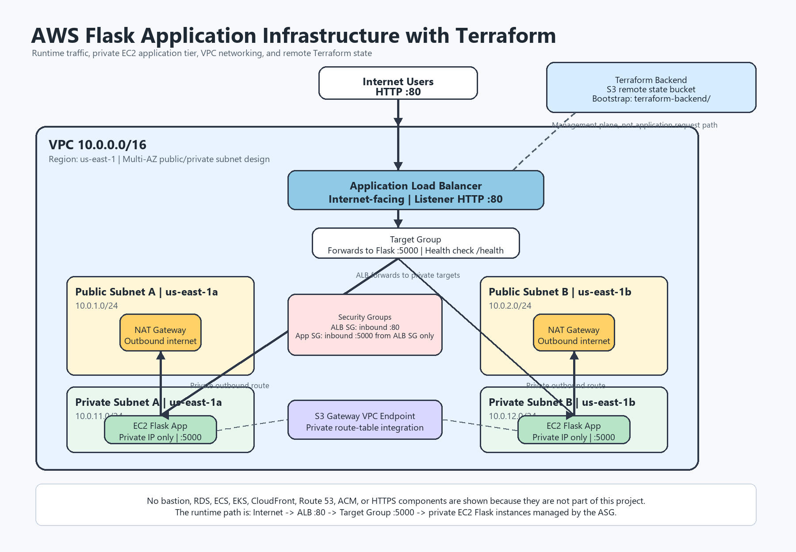

# AWS Flask Application Infrastructure with Terraform

This project provisions a two-tier AWS infrastructure for a Flask application using Terraform.

The application runs on EC2 instances in private subnets across two Availability Zones. An internet-facing Application Load Balancer receives HTTP traffic on port `80` and forwards requests to the Flask application on port `5000`. Private application instances reach the internet through NAT Gateways, and S3 access is provided through an S3 Gateway VPC Endpoint.

## Architecture



### Request Flow

```text
User
  |
  v
Internet
  |
  v
Application Load Balancer :80
  |
  v
Target Group :5000
  |
  v
Auto Scaling Group
  |
  +-- EC2 Flask instance in private subnet, us-east-1a
  |
  +-- EC2 Flask instance in private subnet, us-east-1b
```

### High-Level Design

```text
VPC 10.0.0.0/16
|
+-- Public Subnet A  10.0.1.0/24   us-east-1a
|   +-- Application Load Balancer
|   +-- NAT Gateway A
|
+-- Public Subnet B  10.0.2.0/24   us-east-1b
|   +-- Application Load Balancer
|   +-- NAT Gateway B
|
+-- Private Subnet A 10.0.11.0/24  us-east-1a
|   +-- EC2 Flask instance managed by Auto Scaling Group
|
+-- Private Subnet B 10.0.12.0/24  us-east-1b
    +-- EC2 Flask instance managed by Auto Scaling Group
```

## What This Project Demonstrates

- Terraform Infrastructure as Code
- Reusable Terraform module design
- AWS provider configuration
- Remote Terraform state using an S3 backend
- Separate backend bootstrap workflow
- Multi-AZ VPC architecture
- Public and private subnet separation
- Internet Gateway for public subnets
- NAT Gateways for private subnet outbound access
- Route tables and subnet route associations
- S3 Gateway VPC Endpoint
- Application Load Balancer
- Target Group and health checks
- EC2 Launch Template
- Auto Scaling Group with rolling instance refresh
- IAM role and instance profile for EC2
- Security group separation between ALB and application instances
- Flask application bootstrap using EC2 user data

## Repository Structure

```text
AWS_Flask_Terraform/
|
+-- README.md
+-- .gitignore
+-- LICENSE
|
+-- terraform.tf
+-- providers.tf
+-- backend.tf
+-- variables.tf
+-- terraform.tfvars.example
+-- locals.tf
+-- data.tf
+-- main.tf
+-- outputs.tf
|
+-- modules/
|   |
|   +-- vpc/
|   |   +-- main.tf
|   |   +-- variables.tf
|   |   +-- outputs.tf
|   |   +-- data.tf
|   |
|   +-- security-groups/
|   |   +-- main.tf
|   |   +-- variables.tf
|   |   +-- outputs.tf
|   |
|   +-- alb/
|   |   +-- main.tf
|   |   +-- variables.tf
|   |   +-- outputs.tf
|   |
|   +-- application/
|       +-- main.tf
|       +-- variables.tf
|       +-- outputs.tf
|       +-- user-data.sh
|
+-- terraform-backend/
|   +-- terraform.tf
|   +-- providers.tf
|   +-- main.tf
|   +-- variables.tf
|   +-- terraform.tfvars.example
|   +-- .terraform.lock.hcl
|
+-- docs/
    +-- architecture.png
    +-- screenshots/
```

## Architecture Components

### VPC

The VPC module creates the network foundation for the application.

- VPC CIDR: `10.0.0.0/16`
- Region: `us-east-1`
- Availability Zones:
  - `us-east-1a`
  - `us-east-1b`
- Public subnets:
  - `10.0.1.0/24`
  - `10.0.2.0/24`
- Private subnets:
  - `10.0.11.0/24`
  - `10.0.12.0/24`

The public subnets host internet-facing resources such as the Application Load Balancer and NAT Gateways. The private subnets host the application EC2 instances.

### Internet Gateway

The Internet Gateway provides inbound and outbound internet connectivity for public subnet resources.

### NAT Gateways

Each public subnet contains a NAT Gateway. Private subnet route tables send outbound internet traffic through the NAT Gateway in the corresponding Availability Zone.

This allows private EC2 instances to install packages and reach external services without receiving public IP addresses.

### S3 Gateway VPC Endpoint

The project includes an S3 Gateway VPC Endpoint so resources inside the VPC can access Amazon S3 through AWS private networking paths instead of relying only on NAT Gateway egress.

## Security Groups

The security group design separates public entry traffic from private application traffic.

### ALB Security Group

The ALB security group allows:

- Inbound HTTP traffic on port `80`
- Outbound traffic to the application target group

### Application Security Group

The application security group allows:

- Inbound traffic on port `5000` only from the ALB security group
- Outbound traffic required for package installation and application operation

The EC2 application instances are not directly exposed to the internet.

## ALB and Auto Scaling Flow

The Application Load Balancer is deployed across the public subnets. It listens on HTTP port `80` and forwards requests to a Target Group on port `5000`.

The Auto Scaling Group launches Flask application instances in the private subnets. The ASG is configured with:

- Desired capacity: `2`
- Minimum size: `2`
- Maximum size: `4`
- Health check type: `ELB`
- Health check grace period: `180` seconds
- Rolling instance refresh strategy

The target group health check uses the Flask health endpoint:

```text
/health
```

## Application Bootstrap

The application module uses an EC2 Launch Template and user data script to bootstrap the Flask application on instance launch.

At a high level, the instance bootstrap process:

1. Installs required runtime packages.
2. Creates or configures the Flask application.
3. Starts the application service.
4. Exposes the application on port `5000`.
5. Responds to ALB health checks on `/health`.

## Terraform Remote Backend

This project uses a separate backend bootstrap directory:

```text
terraform-backend/
```

The backend bootstrap creates the S3 bucket used for Terraform remote state. The backend must exist before initializing the main infrastructure.

Recommended workflow:

```powershell
cd terraform-backend
terraform init
terraform plan
terraform apply
```

Then initialize the main project:

```powershell
cd ..
terraform init
```

The main project backend configuration is kept in:

```text
backend.tf
```

Do not commit local Terraform state files. Keep only the backend configuration and lock files that are meant to be version controlled.

## Prerequisites

- Terraform installed
- AWS CLI installed
- AWS credentials configured locally
- An AWS account with permissions to create:
  - VPC resources
  - EC2 resources
  - Elastic Load Balancing resources
  - Auto Scaling resources
  - IAM role and instance profile
  - S3 backend resources

## Configuration

Create a local variables file from the example:

```powershell
Copy-Item terraform.tfvars.example terraform.tfvars
```

Example values:

```hcl
aws_region = "us-east-1"

project_name = "Terraform-flask-app"
environment  = "dev"

vpc_cidr = "10.0.0.0/16"

availability_zones = [
  "us-east-1a",
  "us-east-1b"
]

public_subnet_cidrs = [
  "10.0.1.0/24",
  "10.0.2.0/24"
]

private_subnet_cidrs = [
  "10.0.11.0/24",
  "10.0.12.0/24"
]

app_port          = 5000
health_check_path = "/health"

instance_type    = "t3.micro"
desired_capacity = 2
min_size         = 2
max_size         = 4
```

For a public GitHub repository, keep the real `terraform.tfvars` file local and commit only `terraform.tfvars.example`.

## Deployment

Format and validate the configuration:

```powershell
terraform fmt -recursive
terraform validate
```

Review the execution plan:

```powershell
terraform plan -out=tfplan
```

Apply the saved plan:

```powershell
terraform apply "tfplan"
```

After deployment, Terraform should output values such as:

```text
alb_dns_name
alb_arn
target_group_arn
autoscaling_group_name
launch_template_id
```

## Validation

Confirm Terraform state matches the deployed infrastructure:

```powershell
terraform plan
```

Expected result:

```text
No changes. Your infrastructure matches the configuration.
```

Check the Auto Scaling Group instances:

```powershell
aws autoscaling describe-auto-scaling-groups `
  --auto-scaling-group-names Terraform-flask-app-dev-app-asg `
  --query "AutoScalingGroups[0].Instances[*].[InstanceId,AvailabilityZone,HealthStatus,LifecycleState]" `
  --output table
```

Expected result:

```text
2 instances
Healthy
InService
Distributed across us-east-1a and us-east-1b
```

Check ALB target health:

```powershell
aws elbv2 describe-target-health `
  --target-group-arn "<target_group_arn>" `
  --query "TargetHealthDescriptions[*].[Target.Id,TargetHealth.State,TargetHealth.Reason]" `
  --output table
```

Expected target health:

```text
healthy
```

Test the Flask health endpoint through the ALB:

```powershell
curl http://<alb_dns_name>/health
```

Expected response:

```json
{
  "status": "UP"
}
```

Test the root endpoint:

```powershell
curl http://<alb_dns_name>/
```

Expected response:

```json
{
  "application": "terraform-flask-app",
  "status": "UP"
}
```

## Screenshots

Recommended screenshots for GitHub documentation:

| Screenshot | Suggested path | Purpose |
|---|---|---|
| Architecture diagram | `docs/architecture.png` | Shows the full project design |
| Terraform plan clean state | `docs/screenshots/terraform-plan.png` | Shows no pending infrastructure changes |
| Terraform outputs | `docs/screenshots/terraform-output.png` | Shows generated infrastructure outputs |
| VPC resource map | `docs/screenshots/vpc-resource-map.png` | Shows VPC, subnets, routes, NAT, and gateway layout |
| Auto Scaling Group | `docs/screenshots/autoscaling-group.png` | Shows desired/min/max capacity and instances |
| Target health | `docs/screenshots/target-health.png` | Shows healthy registered targets |
| Application response | `docs/screenshots/application-response.png` | Shows Flask response through the ALB |

Keep screenshots focused. The strongest evidence for this project is the architecture diagram, clean Terraform plan, ASG instance health, ALB target health, and live application response.

## Cleanup

To avoid ongoing AWS charges, destroy the main application infrastructure when it is no longer needed:

```powershell
terraform destroy
```

Review the destroy plan carefully before confirming.

Resources removed by the main project include:

- Application Load Balancer
- Target Group
- Auto Scaling Group
- EC2 instances
- Launch Template
- NAT Gateways
- Elastic IPs used by NAT Gateways
- Route tables and associations
- Public and private subnets
- Internet Gateway
- S3 Gateway VPC Endpoint
- Security groups
- IAM role and instance profile
- VPC

Do not destroy the backend bootstrap directory unless you intentionally want to remove the Terraform remote state infrastructure:

```text
terraform-backend/
```

## GitHub Safety Checklist

Do not commit:

```text
.terraform/
terraform.tfstate
terraform.tfstate.*
*.tfplan
tfplan
terraform.tfvars
terraform-backend/terraform.tfvars
.env
.env.*
*.pem
*.key
AWS credentials
```

Commit:

```text
README.md
.gitignore
terraform.tfvars.example
terraform-backend/terraform.tfvars.example
.terraform.lock.hcl
terraform-backend/.terraform.lock.hcl
docs/architecture.png
selected docs/screenshots/*.png
```

## Learning Notes and Key Concepts

### Public vs Private Subnets

The ALB is public because users need to reach it from the internet. The EC2 instances are private because users should not connect to application servers directly.

### ALB to Private EC2

The ALB receives HTTP traffic on port `80` and forwards it to private EC2 instances on port `5000`. Security groups enforce that only the ALB can reach the Flask application port.

### NAT Gateway

Private instances do not have public IP addresses. NAT Gateways allow those instances to initiate outbound internet requests, such as package downloads during bootstrapping.

### S3 Gateway Endpoint

The S3 Gateway Endpoint allows VPC resources to reach S3 through AWS networking without depending only on NAT Gateway egress for S3 traffic.

### Auto Scaling Group

The ASG keeps the desired number of EC2 instances running and places them across private subnets in multiple Availability Zones.

### Remote State

Remote state keeps Terraform state outside the local machine and makes infrastructure management more reliable than local-only state files.

### Saved Terraform Plans

Using `terraform plan -out=tfplan` and then `terraform apply "tfplan"` ensures Terraform applies the exact reviewed plan.

## Final Validation Status

The project was validated with:

- Successful Terraform apply
- Clean Terraform plan after deployment
- Active Application Load Balancer
- Healthy Target Group targets
- Auto Scaling Group with two healthy instances
- Flask `/health` endpoint returning `UP`
- Flask root endpoint reachable through the ALB
- S3 Gateway VPC Endpoint available

